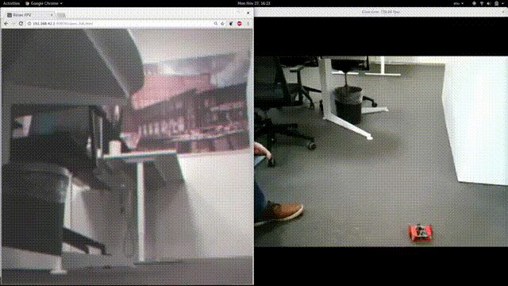

# FPV Rover control

This repo contains an Android app and Python script to control a robot from
either device by tilting it. It connects to the robot's TCP server and displays
the incoming video stream from the on-board camera.

<!-- Linux -->

<a href="https://www.youtube.com/watch?v=wDgaU4p27KY" target="_blank">Linux script</a>

<!-- Android -->

<a href="https://www.youtube.com/watch?v=9SWERYR-c74" target="_blank">Android app</a>

